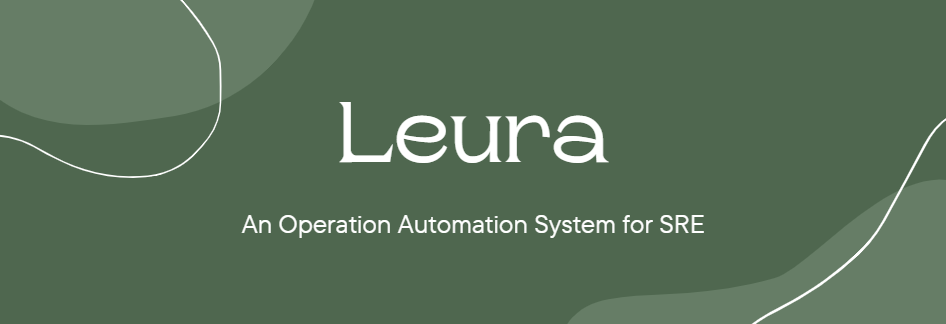

# Project Leura

---

Leura is a high-performance operation automation system designed to manage and execute various tasks across multiple platforms effectively. It offers comprehensive functionalities for task scheduling, script management, and task arrangement, making it an essential tool for SRE.

## Key Features

### Monolithic Architecture

Leura’s monolithic design is lightweight and efficient, resulting in faster performance, simpler deployment, and minimal complexity.

### High-Performance Execution Engine

Leura takes advantages from the Event Loop model and Go’s powerful concurrency functionalities, using goroutines to manage parallel tasks, ensuring high performance even under heavy workloads.

### Powerful Workflow Management

Leura’s powerful task management features allow users to setup and execute complicated multi-step workflows efficiently. Instead of manually executing each step, Leura can automatically identify, schedule, and execute task steps, ensuring maintainability and reducing human errors.

## Main Technology Stack

- **Programming language**: Go 1.21
- **API library**: gRPC Gateway
- **Database**: MongoDB
- **Large file storage**: MinIO

## License

Leura is licenced under the [MIT Licence](LICENSE).

We commit to keeping the project open-source under the MIT licence for all future versions.